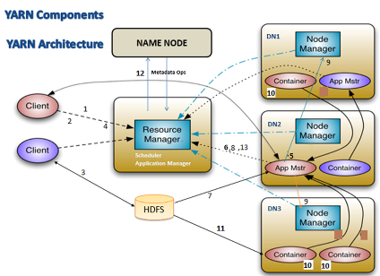
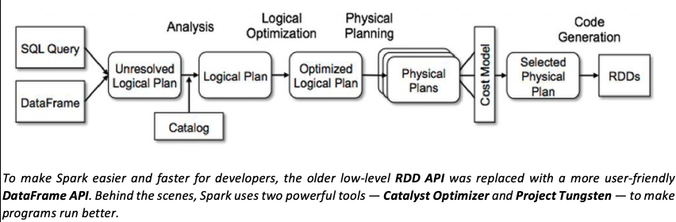

# 🐘 Hadoop, 🧵 YARN & ⚡ Spark

### Q1. What Happens When you Submit a Job in YARN?

<details>
  <summary> Click to view YARN architecture diagram</summary>
  
</details>

#### 1️⃣ Contact with Resource Manager (RM)

* The **primary POC** will be the **Resource Manager (RM)** 🗂️
* Program will be called `job.submit`.
* In the background, RM contacts **NameNode (NN)** 🏷️ to get **metadata** info of the data.

#### 2️⃣ RM Response to Client

* RM responds with:

  * **Max(Job\_ID)** 🆔
  * **Metadata information** (which DataNodes contain the blocks).

#### 3️⃣ Input Split & Job Resources Preparation

* Client calculates the **input split** using metadata info.
* Copies the following into **HDFS temp location** 📂 `hdfs://tmp/staging/job_id_101/...`:

  * Input split specification
  * `mr.jar` program
  * Additional libraries 📚
  * Property files ⚙️
  * Configuration files 📝

#### 4️⃣ Submit Application

* Client contacts RM again and calls `submit.application`.

#### 5️⃣ Application Master (AM) Creation

* RM (via **Schedulers: Fair, Capacity, FIFO ⏳**) provides approval.
* RM requests a **Node Manager (NM)** 🖥️ to create a container.
* The **Application Master program** 🧑‍💻 gets started inside that container.

#### 6️⃣ AM Registers with RM

* Application Master (AM) 📡 registers itself with Resource Manager.

#### 7️⃣ AM Copies Job Resources

* AM retrieves job resources from **HDFS temp location** created in step 3.

#### 8️⃣ AM Negotiates Resources

* AM negotiates with RM 🤝 and gets approval to contact the respective Node Managers.

#### 9️⃣ Launching Containers

* AM works with NM to **launch containers** with given specifications.

#### 🔟 Containers Creation

* Node Manager creates **containers** 🏗️ where **Mapper/Reducer programs** will run.

#### 1️⃣1️⃣ Copy Job Resources into Containers

* Copy of job resources from common HDFS location → inside the container 📦.
* Prepares to start Mapper/Reducer program.

#### 1️⃣2️⃣ Mapper Execution & Status Report

* Mapper(s) 🗂️ send status reports to AM.
* AM forwards status updates 📡 to the Job Client.

#### 1️⃣3️⃣ Job Completion

* Once all **Mappers & Reducers** ✅ finish, job is marked as complete.

---


### Q2. What Happens When I Submit a Spark Job in **Cluster** Mode?

⚡ Spark Cluster Mode — Detailed Flow

```pgsql
🧑‍💻 1. Client (spark-submit)
    └─> 📦 Application Master (YARN) / Cluster Manager
          • Client uploads app jars & staging (HDFS) then can safely disconnect
          • RM/AM take over lifecycle of the Driver
          |
          v
🚗 2. Driver (runs inside cluster)
   • Driver is launched inside AM container in cluster
   • Builds DAG, schedules tasks, tracks job state (inside cluster)
          |
          v
     🔄 Build DAG (stages & tasks)
          • Plan execution (stages, tasks, partitions)
          |
          v
🤝 3. Driver contacts Resource Manager (YARN / K8s / Mesos)
          • Driver requests executor containers/resources via RM
          |
          v
🖥️ 4. Node Managers (across cluster)
    └─> 📦 Executors launched
          • Executors are long-lived JVMs on worker nodes
          • Launched with required jars/configs from staging
          |
          v
🖥️ 5. Executors register with Driver (inside cluster)
          • Fast local network registration (no external client hop)
          |
          v
 🚗6. Driver schedules tasks → Executors run them
          • Driver assigns tasks based on locality & resources
          • Tasks execute in parallel on executors
          |
          v
🗄️ 7. Executors process data (HDFS / external sources)
          • Read HDFS/DBs/S3, cache partitions in memory/disk, do shuffle
          |
          v
📡 8. Executors send status & results → Driver (in cluster)
          • Progress, metrics, task failures reported to Driver/AM/RM
          |
          v
✅ 9. Job Completion
    └─> Executors shut down
    └─> Driver exits (in cluster)
    └─> AM deregisters from RM; resources released

```
---

### Q3. What Happens When I Submit a Spark Job in **Client** Mode?

⚡ Spark Client Mode — Detailed Flow

```pgsql
🧑‍💻 Client (spark-submit)
   └─> 🚗 Driver (runs on client machine)
          • Driver is a local JVM: builds DAG, schedules tasks, tracks job state
          • Client machine must remain reachable and healthy
          |
          v
     🔄 Build DAG (stages & tasks)
          • Plan execution (stages, tasks, partitions)
          |
          v
🤝 Driver contacts Resource Manager (YARN / K8s / Mesos)
          • Requests executor containers/resources
          • May upload jars/configs to staging on HDFS
          |
          v
🖥️ Node Managers (across cluster)
   └─> 📦 Executors launched
          • Executors are long-lived JVMs on worker nodes
          • Launched with required jars/configs
          |
          v
📂 Executors register with Driver (over network)
          • Executors open RPC/Netty connections to Driver
          • Heartbeats & registration info flow over network
          |
          v
⚡ Driver schedules tasks → Executors run them
          • Driver assigns tasks based on locality & resources
          • Tasks execute in parallel on executors
          |
          v
🗄️ Executors process data (HDFS / external sources)
          • Read HDFS/DBs/S3, cache partitions in memory/disk, do shuffle
          |
          v
📡 Executors send status & results → Driver (on client)
          • Progress, metrics, task failures sent to Driver
          • Driver may retry failed tasks / reschedule
          |
          v
✅ Job Completion
   └─> Executors shut down
   └─> Driver exits (on client)
   └─> Resources released by RM

```

---

### Q4. Comparision between YARN MapReduce vs Spark Cluster Mode vs Spark Client Mode

| Aspect                       | 🗂️ **YARN MapReduce (MR)**                            | ⚡ **Spark — Cluster Mode**                                                                 | 💻 **Spark — Client Mode**                                                                        |
| ---------------------------- | ------------------------------------------------------ | ------------------------------------------------------------------------------------------ | ------------------------------------------------------------------------------------------------- |
| **Submit command**           | `hadoop jar myjob.jar ...`                             | `spark-submit --master yarn --deploy-mode cluster my_app.jar ...`                          | `spark-submit --master yarn --deploy-mode client my_app.jar ...`                                  |
| **Primary coordinator**      | **ResourceManager (RM)** + **ApplicationMaster (AM)**. | **Driver** (inside cluster, started by AM).                                                | **Driver** runs on client machine; AM only manages executors.                                     |
| **Who schedules tasks**      | **ApplicationMaster** (MR job AM).                     | **Driver** schedules DAG stages & tasks.                                                   | **Driver** (on client) schedules tasks; sends them to cluster executors.                          |
| **Runtime units**            | Short-lived JVMs for **Map/Reduce tasks**.             | Long-lived **Executors** (JVMs) running many tasks.                                        | Same long-lived **Executors**; Driver stays on client side.                                       |
| **Where driver runs**        | Not applicable (no driver concept; AM is coordinator). | **Inside cluster** (AM container).                                                         | **On client machine** (local JVM process).                                                        |
| **Resource allocation flow** | Client → RM → AM → NMs → containers → MR tasks.        | `spark-submit` → RM launches AM+Driver → Driver requests executors → NMs launch executors. | `spark-submit` launches Driver locally → Driver requests RM for executors → NMs launch executors. |
| **Network dependency**       | Client only submits, then can disconnect safely.       | Client submits and exits; Driver inside cluster continues independently.                   | Client must stay alive throughout; Driver is on client → failure of client = job failure.         |
| **Data locality**            | Strong — tasks scheduled close to HDFS blocks.         | Good — executors try to run near HDFS blocks.                                              | Same as cluster mode for executors, but Driver might be remote.                                   |
| **Execution model**          | Two-phase (map → shuffle → reduce).                    | DAG of stages; pipelined.                                                                  | Same DAG execution model.                                                                         |
| **Shuffle handling**         | Disk-based shuffle.                                    | Memory/disk shuffle, optimized with external shuffle service.                              | Same as cluster mode.                                                                             |
| **Fault tolerance**          | Rerun failed MR tasks.                                 | Recompute lost partitions via lineage.                                                     | Same as cluster mode (executors recompute).                                                       |
| **Performance**              | Disk I/O heavy; slower for iterative workloads.        | Faster for iterative, ML, streaming (in-memory).                                           | Similar performance, but higher latency if Driver-client network is far from cluster.             |
| **Startup latency**          | JVM per task (higher overhead).                        | Executors are long-lived → amortized.                                                      | Executors long-lived → but job start tied to client Driver.                                       |
| **Monitoring UI**            | YARN RM / AM logs.                                     | Spark Web UI (Driver inside cluster) accessible via YARN.                                  | Spark Web UI runs on Driver (client machine); less accessible to others.                          |
| **Client reliability**       | After submission, client can disconnect.               | Client can disconnect, Driver inside cluster continues.                                    | Client must stay connected — Driver on client is critical.                                        |
| **Use cases**                | Batch ETL, legacy MR.                                  | Production workloads, long-running apps, jobs submitted remotely.                          | Development, interactive jobs (e.g., notebooks, testing locally).                                 |


#### 🧭 Quick Flow Differences

* **YARN MR:** Client → RM → AM schedules Mappers/Reducers → Job complete.
* **Spark Cluster Mode:** Client → RM → AM launches Driver inside cluster → Driver schedules tasks → Executors run tasks → Job complete.
* **Spark Client Mode:** Client → launches Driver locally → Driver requests executors from RM → Executors run tasks → Driver collects results → Job complete.

---


### Q5. I would like to read the csv file from a HDFS location, then remove duplicates and write into Hive table using Spark program.   What happens internally if we submit this spark job?

 ⚡ Spark Internals — Cluster Mode with Catalyst & Tungsten

#### 1. **Job Submission** 📨

* `spark-submit` in **cluster mode**.
* Client uploads:

  * 📦 Application JAR / Py file
  * ⚙️ Config files, Hive configs, dependencies
* Client hands off control to **🗂️ Resource Manager (RM)** and can safely disconnect. ✅


#### 2. **Driver Launch** 🚗

* **📦 Application Master (AM)** starts a **Driver** container in the cluster.
* Driver acts as **master orchestrator**:

  * 📜 Reads application code
  * 🧩 Builds **logical plan** from DataFrame/Dataset operations


#### 3. **Logical Plan Creation** 🧠

* Program:

```python
df = spark.read.csv("hdfs://...")  
df_dedup = df.dropDuplicates()  
df_dedup.write.saveAsTable("hive_table")
```

* Driver parses it into **logical plan**:

  * `ReadCSV → Deduplicate → WriteHiveTable`
  * Represents **abstract operations**, no physical execution yet
* DAG (Directed Acyclic Graph) for Spark is **implicitly created at this stage**, representing the transformations as nodes:

  * Node 1: Read CSV
  * Node 2: Deduplicate
  * Node 3: Write Hive Table


#### 4. **Catalyst Optimizer** ✨

* Catalyst applies transformations to the logical plan:

  * 🔍 **Analysis**: resolves column names, data types, Hive metadata
  * ♻️ **Logical Optimizations**:

    * Filter pushdown (if any)
    * Projection pruning
    * Remove redundant computations
* Result: **optimized logical plan**
* DAG is **updated with optimized operations**, ready for physical planning ✅

#### 5. **Physical Plan Generation** 🏗️

* Catalyst converts optimized logical plan into **physical plan(s)**:

  * Maps logical nodes to **RDD/DataFrame transformations**

    * Example: `CSV → Rows → Deduplicate → Write to HDFS`
  * Decides:

    * Stage boundaries
    * Task partitioning
    * Shuffles and data movement
* **Driver chooses the most efficient plan** for execution
* DAG now **represents stages**:

  * Stage 1: Read CSV
  * Stage 2: Shuffle & Deduplicate
  * Stage 3: Write to Hive

#### 6. **Tungsten Execution** ⚡

* Optimizes physical execution:

  * 🧠 **Memory Management**: off-heap storage reduces GC overhead
  * 🏎️ **Code Generation**: Java bytecode for transformations
  * 🗄️ **Binary Processing**: efficient in-memory row format
* Tasks running on executors are now **highly optimized** for CPU & memory efficiency
* DAG nodes now correspond to **actual physical tasks** executed by executors


#### 7. **Reading CSV from HDFS** 🗂️

* Driver schedules **tasks** from Stage 1 to **Executors**
* Executors:

  * Read HDFS blocks (data-locality optimized)
  * Parse CSV rows into **internal row objects** (Tungsten binary format)
* DAG shows **parallelism per partition**, with tasks mapped to executors


#### 8. **Deduplication** 🔄

* `dropDuplicates()` triggers **Stage 2** and a **shuffle**:

  * Partitions rows by hash of all columns
  * Executors exchange rows over network
  * Tungsten optimizes in-memory aggregation & minimizes serialization
* DAG visualizes **shuffle edges** between stages, representing data movement

#### 9. **Writing to Hive Table** 🏛️

* Stage 3 of DAG executes:

  * Executors write partitions to HDFS (managed/external table)
  * Hive Metastore updated by Driver/Hive connector
  * Tungsten optimizes serialization and write buffers
* DAG edges from Stage 2 → Stage 3 ensure **task dependencies** are respected

#### 10. **Execution Tracking** 📊

* Driver tracks:

  * Task progress
  * Stage completion
  * Retries for failed tasks
  * Maintains **Spark UI** with DAG visualization
* Executors:

  * Run physical plan tasks
  * Send metrics & status to Driver
* DAG allows **Driver to schedule tasks efficiently** while monitoring execution


#### 11. **Job Completion** ✅

* Executors shut down
* Driver exits (inside cluster)
* AM deregisters from **Resource Manager**
* DAG execution is complete, job finishes successfully


#### 🔑 Key Internals Summary

| Component                     | Role in CSV → Dedup → Hive                                                               |
| ----------------------------- | ---------------------------------------------------------------------------------------- |
| 🧠 **Logical Plan**           | Abstract representation: ReadCSV → Deduplicate → WriteHiveTable                          |
| ✨ **Catalyst Optimizer**      | Resolves columns/types, optimizes operations (filter pushdown, projection pruning)       |
| 🏗️ **Physical Plan**         | Maps logical plan to real operations: RDD/DataFrame transformations, shuffle, partitions |
| ⚡ **Tungsten**                | Low-level execution engine: off-heap memory, code generation, binary row format          |
| 🚗 **Driver**                 | Builds plans, schedules tasks, coordinates execution, talks to Hive Metastore            |
| 📦 **Executors**              | Read HDFS blocks, run transformations, shuffle for dedup, write results, report status   |
| 🗂️ **Resource Manager / AM** | Allocates containers, manages Driver lifecycle                                           |



---

# 🔥 Common & Important Spark Internals (with Examples)

## 1. Have you written RDD transformations?

Yes. RDDs support **transformations** (lazy ops) and **actions** (trigger execution).

### Example: `map` vs `flatMap`

```python
from pyspark.sql import SparkSession
spark = SparkSession.builder.appName("Demojob").enableHiveSupport().getOrCreate()

def main():
    # map -> one input -> one output
    rdd = spark.sparkContext.parallelize(["apple","banana","orange"])
    mapped = rdd.map(lambda x: (x, len(x)))
    print("[INFO] mapped:", mapped.collect())
    #[INFO] mapped: [('apple', 5), ('banana', 6), ('orange', 6)]

    # flatmap -> one input -> multiple output
    rdd2 = spark.sparkContext.parallelize(["1  2","3 4  5","6  7 8  9"])
    flatmapped = rdd2.flatMap(lambda x: x.split(" "))
    print("[INFO] flatmapped:",flatmapped.collect())
    #[INFO] flatmapped: ['1', '', '2', '3', '4', '', '5', '6', '', '7', '8', '', '9']

if __name__ =="__main__":
    main()
    spark.stop()
```

👉 In real projects, developers prefer **DataFrames/SQL** because Catalyst Optimizer + Tungsten provide automatic optimizations.

---

## 2. How to schedule a Spark job?

* **On-Prem**: cron, autosys, Control-M, Oozie, Airflow
* **Cloud**: GCP Cloud Composer (Airflow), Dataproc workflow template, Databricks Jobs

### Example: simple cron job

```bash
crontab -l
crontab -e

0 2 * * * spark-submit --master yarn --deploy-mode client ~/demojob.py
```

---

## 3. How to orchestrate a Spark job?

* **On-Prem**: Oozie (Spark action), Airflow DAG, Shell Scripts
* **Cloud**: Dataproc Workflow, Databricks Jobs API, Cloud Composer (Airflow)

### Example: Airflow (Python DAG)

```python
from airflow import DAG
from airflow.providers.apache.spark.operators.spark_submit import SparkSubmitOperator
from datetime import datetime

with DAG("spark_job_dag", start_date=datetime(2024,1,1), schedule="@daily") as dag:
    spark_task = SparkSubmitOperator(
        task_id="spark_job",
        application="/path/to/app.py",
        conn_id="spark_default",
        conf={"spark.yarn.maxAppAttempts": "2"}
    )
```

---

## 4. How to set number of attempts in `spark-submit`?

```bash
spark-submit \
  --conf spark.yarn.maxAppAttempts=2 \
  demojob.py
```

👉 In **Airflow**, use `retries=2`.

---

## 5. How do you define SparkContext / SparkSession?

* **SparkContext**: entry point for low-level RDD API.
* **SparkSession**: unified entry point for DataFrame/SQL API (wraps `SparkContext`).

### Example

```python
from pyspark.sql import SparkSession

spark = SparkSession.builder \
    .appName("DemoApp") \
    .enableHiveSupport() \
    .getOrCreate()

sc = spark.sparkContext
print(sc)   # SparkContext info

spark.stop()
```

---

## 6. Can we have multiple SparkContexts?

* ❌ No, only **one active SparkContext** at a time.
* ✅ You can stop and recreate with new configs.

---

## 7. Can we run Spark without SparkSession?

* ✅ Yes, using `SparkContext` only (RDD API).
* ❌ But for SQL/DF API, we **must use SparkSession**.

---

### Example: RDD program without SparkSession

```python
from pyspark import SparkContext

sc = SparkContext("local", "RDDOnlyApp")
rdd = sc.parallelize([1, 2, 3, 4])
print(rdd.map(lambda x: x * 2).collect())
sc.stop()
```

---

## 8. What happens when a Spark SQL/DSL program runs?

👉 Flow:
SQL/DSL → Logical Plan → Optimized Logical Plan → Physical Plan → RDD DAG → Stages → Tasks → Executors

### Example: SQL → Plan

```python
# SQL/DSL -> Logical Plan -> Optimized Logical Plan -> Physical Plan -> RDD DAG -> Stages -> Tasks -> Executors
df = spark.createDataFrame(data=[(1,"A"),(2,"B"),(3,"C")], schema=["id","name"])
df.createOrReplaceTempView("view1")

spark.sql("select * from view1 where id=1").explain(extended=True)

"""
== Parsed Logical Plan ==
'Project [*]
+- 'Filter ('id = 1)
   +- 'UnresolvedRelation [view1], [], false

== Analyzed Logical Plan ==
id: bigint, name: string
Project [id#0L, name#1]
+- Filter (id#0L = cast(1 as bigint))
   +- SubqueryAlias view1
      +- View (`view1`, [id#0L,name#1])
         +- LogicalRDD [id#0L, name#1], false

== Optimized Logical Plan ==
Filter (isnotnull(id#0L) AND (id#0L = 1))
+- LogicalRDD [id#0L, name#1], false

== Physical Plan ==
*(1) Filter (isnotnull(id#0L) AND (id#0L = 1))
+- *(1) Scan ExistingRDD[id#0L,name#1]
"""
```

---

## 9. PySpark DSL vs SQL

| **Aspect**      | **PySpark DSL**                                           | **PySpark SQL**                                                       |
| --------------- | --------------------------------------------------------- | --------------------------------------------------------------------- |
| **Style**       | Functional programming with method chaining on DataFrames | Declarative SQL-like syntax                                           |
| **Ease of Use** | Steeper learning curve, suits programmers                 | Easier for SQL users, readable                                        |
| **Use Case**    | Complex, reusable, programmatic transformations           | Simple, ad-hoc analytical queries                                     |
| **Integration** | Works well with Python logic and functions                | Keeps SQL logic separate from Python code                             |
| **Performance** | Optimized by Catalyst and Tungsten (same as SQL)          | Optimized by Catalyst and Tungsten (same as DSL)                      |
| **Flexibility** | High – allows chaining, reusable DataFrames               | Moderate – limited to SQL expressions                                 |
| **Portability** | Spark-specific, not platform independent                  | Platform independent (works across BigQuery, Synapse, Redshift, etc.) |
| **Best For**    | ETL pipelines, data transformations, reusable logic       | Reporting, analytics, one-time queries                                |
| **Conclusion**  | Flexible and suited for complex transformations           | Easier, ideal for ad-hoc queries and cross-platform use               |


### Example

```python
"""
demojob.py

custs
4000001,Kristina,Chung,55,Pilot
4000002,Paige,Chen,77,Teacher
4000003,Sherri,Melton,34,Firefighter
"""
from pyspark.sql import SparkSession
from pyspark.sql.types import StructType,StructField,StringType,IntegerType
spark = SparkSession.builder.appName("demojob").enableHiveSupport().getOrCreate()

def main():
    custs_schema = StructType([
        StructField("custid",IntegerType(),True),
        StructField("fname",StringType(),True),
        StructField("lname",StringType(),True),
        StructField("age",IntegerType(),True),
        StructField("prof",StringType(),True)])
    #DSL
    df = spark.read.csv(path="hdfs:///home/hduser/custs",header=False,schema=custs_schema)
    df.filter(df.age > 40).select(df.custid,df.fname,df.lname,df.age,df.prof).orderBy(df.fname).show(5,truncate=False)

    #SQL
    df.createOrReplaceTempView("customers")
    spark.sql("select custid, fname, lname,age,prof from customers order by fname").show(5, truncate=False)

if __name__ =="__main__":
    main()
    spark.stop()
```
---

## 10. Repartition, Coalesce, Cache

| **Aspect**                      | **Repartition**                                                                   | **Coalesce**                                                         | **Cache / Persist**                                                       |
| ------------------------------- | --------------------------------------------------------------------------------- | -------------------------------------------------------------------- | ------------------------------------------------------------------------- |
| **Purpose**                     | Increases or decreases the number of partitions for parallelism                   | Reduces the number of partitions without a full shuffle              | Stores DataFrame in memory (or memory + disk) for faster access           |
| **Shuffle**                     | **Yes** – performs a **full shuffle** across the cluster                          | **No (or minimal)** – tries to merge partitions locally              | **No shuffle** – just caches data in memory                               |
| **When to Use**                 | When you need **more partitions** for parallel processing or balanced workload    | When you need **fewer partitions** to optimize small output datasets | When the same DataFrame is used **multiple times** in a job               |
| **Performance Cost**            | **High** – due to full data shuffle                                               | **Low** – merges existing partitions                                 | **Low/Medium** – depends on memory availability                           |
| **Example**                     | `df.repartition(8)`                                                               | `df.coalesce(2)`                                                     | `df.cache()` or `df.persist(StorageLevel.MEMORY_AND_DISK)`                |
| **Typical Use Case**            | Before wide transformations (e.g., joins, aggregations) to distribute data evenly | After filtering or reducing data volume to minimize partitions       | Before reusing a DataFrame in multiple actions (e.g., count, show, write) |
| **Effect on Data Distribution** | Redistributes data evenly across partitions                                       | Does not guarantee even distribution                                 | No effect on partitioning or data distribution                            |
| **Action Triggered?**           | No – lazy operation                                                               | No – lazy operation                                                  | No – lazy operation (materialized on first action)                        |
| **Persistence Type**            | Restructures data                                                                 | Merges partitions                                                    | Keeps data in memory/disk for reuse                                       |
| **Conclusion**                  | Use for **balancing and scaling up**                                              | Use for **scaling down efficiently**                                 | Use for **reusing results quickly**                                       |


```python
df = spark.range(1, 100)
print(df.rdd.getNumPartitions()) # default: 5

df = df.repartition(10) # increase partitions (full shuffle across the cluster)
print(df.rdd.getNumPartitions())  # 10

df = df.repartition(5) # reduce partitions (full shuffle across the cluster)
print(df.rdd.getNumPartitions())  # 5

df = df.coalesce(2) # reduce partitions (no shuffle. only merge the partitions locally)
print(df.rdd.getNumPartitions())  # 2

df.cache()
print(df.rdd.getStorageLevel()) # Serialized 1x Replicated
```
---

## What are all the activities we can’t do in a DF?

| **S.No** | **Activity**                                                       | **Reason / Explanation**                                                                                                                                                                                                          |
| -------- | ------------------------------------------------------------------ | --------------------------------------------------------------------------------------------------------------------------------------------------------------------------------------------------------------------------------- |
| **1**    | **Cannot modify a DataFrame directly**                             | DataFrames in Spark are **immutable**. Once created, they can’t be updated or modified in place. To change data, you must create a **new DataFrame** with transformations. (Delta Lake enables updates and deletes later.)        |
| **2**    | **Cannot find the number of partitions directly from a DataFrame** | The DataFrame API does not provide a direct method like `df.numPartitions`. To get partition info, you must use the **RDD API** — e.g., `df.rdd.getNumPartitions()`.                                                              |
| **3**    | **Cannot broadcast a DataFrame directly**                          | Spark’s **broadcast function** works on variables, not on DataFrames. To broadcast, you must convert the DataFrame to an **RDD or use broadcast joins** via Spark SQL or the `broadcast()` function from `pyspark.sql.functions`. |

Here’s a simple example of broadcasting in PySpark 👇

### ❌ Not allowed (Direct broadcast on DataFrame)

```python
# This will NOT work
df_broadcast = sc.broadcast(df)   # ❌ Error: Can't broadcast DataFrame
```

### ✅ Correct way (Using broadcast join)

```python
from pyspark.sql import SparkSession
from pyspark.sql.functions import broadcast
spark = SparkSession.builder.appName("demojob").enableHiveSupport().getOrCreate()

def main():
    # Sample DataFrames
    df_large = spark.createDataFrame(data=[(1,"A"),(2,"B"),(3,"C")], schema=["id","value"])
    df_small = spark.createDataFrame(data=[(1, "X"), (2, "Y")], schema=["id", "desc"])

    # Use Broadcast Join
    df_result = df_large.join(broadcast(df_small),"id")
    df_result.show()

if __name__ =="__main__":
    main()
    spark.stop()
    
"""
+---+-----+----+
| id|value|desc|
+---+-----+----+
|  1|    A|   X|
|  2|    B|   Y|
+---+-----+----+
"""
```

**Explanation:**

* The small DataFrame (`df_small`) is **broadcasted** to all worker nodes.
* This avoids shuffling large data during joins, improving performance.


---

## 11. How to find number of jobs running?

```bash
yarn application -list | grep "RUNNING"

#OR

yarn application -list | grep "RUNNING" | awk '{print $1}' > job_list.txt
```

or via Spark History UI.

---

## What is the total number of jobs/applications runs in your cluster per day?

| **Cluster Type**              | **Number of Nodes / Environment** | **Share of Jobs**       | **Job Frequency**              | **Notes**                                 | **Resource Utilization**                  | **Example Use Cases**                                          |
| ----------------------------- | --------------------------------- | ----------------------- | ------------------------------ | ----------------------------------------- | ----------------------------------------- | -------------------------------------------------------------- |
| **Long-running / On-prem**    | 120 nodes, Dataproc cluster       | 50% of total Spark jobs | Hourly, Daily, Weekly, Monthly | Supports continuous data processing 24/7  | 60–70% average, 30–40% buffer for spikes  | ETL pipelines, scheduled batch jobs, continuous streaming      |
| **Ephemeral Clusters**        | Short-lived / on-demand           | 20% of total Spark jobs | Ad-hoc / on-demand             | Runs temporary workloads and experiments  | Scales based on demand                    | Ad-hoc analytics, testing new pipelines, temporary experiments |
| **Serverless Spark Clusters** | Managed serverless environment    | 30% of total Spark jobs | Hourly / Daily / Weekly        | Auto-scales, no cluster management needed | Optimized for spikes and high concurrency | Event-driven processing, auto-scaling jobs, variable workloads |

**Overall Cluster Activity:**

* **Total jobs per day (all clusters):** 300–500+
* **Jobs in your project:** ~80–120+ per day

---

## How many Jobs/Pipelines you developed?

| **Category**                   | **Details**                                              |
| ------------------------------ | -------------------------------------------------------- |
| **Total Pipelines Developed**  | ~40–60 end-to-end data pipelines                         |
| **Development vs Maintenance** | Developed: 20+ <br> Maintained: 20–40+                   |
| **Pipeline Type**              | Batch: 80% <br> Streaming / Near Real-time: 20%          |
| **Data Sources / Ingestion**   | On-prem databases, APIs, flat files, GCS, Pub/Sub, Kafka |
| **Transformations**            | PySpark, Spark SQL, Dataflow                             |
| **Data Quality**               | Validation and quality checks integrated                 |
| **Data Storage / Publishing**  | BigQuery, Hive, downstream APIs                          |
| **Orchestration**              | Airflow / Cloud Composer                                 |

**Key Points:**

* Developed **end-to-end pipelines** covering ingestion, transformation, validation, and publishing.
* Hands-on experience with both **batch and streaming** workflows.
* Integrated **workflow orchestration** and **data quality checks** into pipelines.

---

## How to identifying slow jobs, tracking failures, and optimizing Spark jobs

| **Category**                                                   | **Method / Command**                       | **Purpose / Details**                                               | **Comments / Examples**                                                        |
| -------------------------------------------------------------- | ------------------------------------------ | ------------------------------------------------------------------- | ------------------------------------------------------------------------------ |
| **Identify Slow / Stale Jobs**                                 | `yarn application -list -appStates RUNNING \| awk '$5 > 7200000'` | Lists running jobs exceeding 2 hours (7,200,000 ms)                | `# Helps detect jobs running longer than expected, possibly stale`             |
|                                                                | `yarn application -list \| grep -v "churn" \| grep "default" \| grep "RUNNING" \| awk '{print $1}' > job_list.txt` | Find long-running jobs in a specific queue                            | `# Generates list of job IDs in default queue for monitoring or debugging`     |
|                                                                | ResourceManager / Application Master UI    | Monitor running jobs, resource usage, and executor stats            | `# RM UI (http://<rm_host>:8088) shows live cluster metrics`                   |
|                                                                | Spark UI                                   | Visualize DAG, stages, tasks, shuffle, and executor performance     | `# Identify bottleneck stages, straggler tasks, or skewed data partitions`     |
|                                                                | Oozie / Airflow Console                    | Track workflow-level progress and detect stuck tasks                | `# Useful for jobs orchestrated via Airflow/Oozie; highlights workflow delays` |
| **Track Job Failures**                                         | `yarn application -list 2>/dev/null \| grep "<queue_name>" \| grep "FAILED" \| awk '{print $1}' > job_list.txt` | List failed jobs in a specific queue                                  | `# Captures application IDs of failed jobs for further investigation`         |
|                                                                | `yarn logs -applicationId <app_id>`        | View logs from Application Master / executors                       | `# Helps determine root cause of job failure`                                  |
|                                                                | Spark History Server                       | Review completed job stages, metrics, and failed tasks              | `# Useful for post-mortem analysis of batch jobs`                              |
|                                                                | Airflow / Oozie logs                       | Check task-level failures in workflows                              | `# Pinpoints exact step causing failure in orchestrated pipelines`             |
| **Optimize Spark Job Performance (Multi-node vs Single-node)** | Executor Configuration                     | Tune number of executors, cores, and memory per executor            | `# Avoid too many small executors; match resources to data volume`             |
|                                                                | Partitioning / Shuffling                   | Adjust `spark.sql.shuffle.partitions` or repartition DataFrames     | `# Reduces shuffle overhead; prevents excessive small tasks and stragglers`    |
|                                                                | Task Parallelism                           | Ensure even data distribution; use broadcast joins for small tables | `# Prevents skewed partitions; reduces shuffle and task time`                  |
|                                                                | Caching / Persisting                       | Cache intermediate DataFrames that are reused                       | `# Avoids recomputation for multiple actions on same data`                     |
|                                                                | Spark UI Monitoring                        | Inspect stage execution time, shuffle read/write, and executor logs | `# Identify bottleneck stages and optimize transformations accordingly`        |


### **Additional Comments / Best Practices**

* Slow jobs can be caused by **skewed data, too many small executors, or shuffle-heavy operations**.
* Tracking failed jobs requires **combination of CLI commands, Spark UI, and logs**.
* Optimization often includes **right-sizing executors, tuning shuffle partitions, and caching reused datasets**.
* Using **broadcast joins** and checking **resource alignment with data volume** can significantly reduce execution time.

This approach ensures you can **monitor, troubleshoot, and optimize jobs effectively** across Hadoop/YARN and Spark clusters.

---

## What errors have you faced while debugging your spark code?


| **Error Type**                   | **Description / Cause**                                           | **Example / Notes**                                                       | **Resolution / Fix**                                                                    |
| -------------------------------- | ----------------------------------------------------------------- | ------------------------------------------------------------------------- | --------------------------------------------------------------------------------------- |
| Data Issues                      | Inconsistent, missing, or corrupt data causing runtime errors     | Null values in non-nullable columns, missing partitions                   | Validate and clean data before processing, use `na.fill()`, `drop()`, or default values |
| Format / Type Issues             | Schema mismatch or wrong data type for transformations            | Trying to cast a string column to integer without proper validation       | Cast columns explicitly, use `withColumn()` with proper type conversion                 |
| Memory Issues                    | Out of Memory (OOM) or executor memory errors                     | `java.lang.OutOfMemoryError: Java heap space`                             | Increase executor memory, reduce shuffle partitions, persist/cache intermediate data    |
| Data Availability Issues         | Missing files or inaccessible data sources                        | `java.io.FileNotFoundException` when reading from HDFS or GCS             | Verify file paths, check HDFS/GCS permissions, ensure data exists                       |
| Class Not Found                  | Spark cannot find required classes for UDFs or external libraries | `java.lang.ClassNotFoundException: org.apache.spark.sql.hive.HiveContext` | Add required JARs to classpath, check Spark submit `--jars` or `--packages`             |
| Dependency / JAR Issues          | Conflicts between Spark and external libraries                    | Version mismatch causing runtime errors                                   | Resolve version conflicts, shade dependencies, use compatible library versions          |
| Performance / Skew Issues        | Skewed data causing straggler tasks and slow stages               | Uneven partition sizes leading to some executors taking longer            | Use `repartition()`, `salting`, or broadcast small tables                               |
| Job Failures / Task Retry Errors | Failures in stages due to network, node failure, or retry limits  | Spark retries a stage multiple times before failing                       | Check Spark/YARN logs, handle errors in code, adjust retry configs                      |

If you want, I can **also combine this with the previous Spark/YARN performance optimization table** so you have **one consolidated interview-ready table** with errors, causes, examples, and fixes. Do you want me to do that?

---
## 12. Schema & Cast Examples

```python
from pyspark.sql.types import StructType, StructField, StringType, IntegerType
from pyspark.sql.functions import col

data = [("James", 34, "2006-01-01"), ("Michael", 33, "1980-01-10")]
schema = StructType([
    StructField("name", StringType(), True),
    StructField("age", IntegerType(), True),
    StructField("dob", StringType(), True)
])

df = spark.createDataFrame(data, schema)

df2 = df.withColumn("age_str", col("age").cast("string"))
df2.show()
```

---

## 13. Example RDD to DataFrame Conversion

```python
from pyspark.sql import Row

rdd = sc.parallelize([Row(name="Alice", age=25), Row(name="Bob", age=30)])
df = spark.createDataFrame(rdd)
df.show()
```

---

## 14. Broadcasting Example

```python
from pyspark.sql.functions import broadcast

df1 = spark.createDataFrame([(1, "A"), (2, "B")], ["id", "val"])
df2 = spark.createDataFrame([(1, "X"), (2, "Y")], ["id", "desc"])

df_join = df1.join(broadcast(df2), "id")
df_join.show()
```

---

## 15. Actions vs Transformations

```python
# Transformation (lazy)
rdd = sc.parallelize([1, 2, 3, 4])
mapped = rdd.map(lambda x: x * 2)

# Action (triggers execution)
print(mapped.collect())
```

---

## 16. Speculative Execution

👉 If one executor is slow, Spark relaunches tasks elsewhere. Enable via:

```bash
--conf spark.speculation=true
```

---

## 17. Cache vs Persist

```python
df = spark.range(1, 1000)
df.cache()   # MEMORY_ONLY
df.persist() # default MEMORY_AND_DISK
```

---

## 18. Union with Schema Evolution

```python
df1 = spark.createDataFrame([(1, "A")], ["id", "name"])
df2 = spark.createDataFrame([(2,)], ["id"])

df_union = df1.unionByName(df2, allowMissingColumns=True)
df_union.show()
```

---

## 19. What is the difference between RDD, DataFrame, and Dataset?

* **RDD**: Low-level, type-unsafe, no schema, transformations & actions.
* **DataFrame**: High-level, schema-based, optimized by Catalyst.
* **Dataset**: Type-safe DataFrame (only in Scala/Java).

```python
rdd = sc.parallelize([("Alice", 25), ("Bob", 30)])
df = rdd.toDF(["name", "age"])
df.show()
```

---

## 20. What are Spark Transformations and Actions?

* **Transformations**: Lazy (e.g., `map`, `filter`)
* **Actions**: Trigger execution (e.g., `collect`, `count`)

```python
rdd = sc.parallelize([1, 2, 3])
mapped = rdd.map(lambda x: x * 2)   # transformation
print(mapped.collect())             # action
```

---

## 21. Explain narrow vs wide transformations.

* **Narrow**: No shuffle (e.g., `map`, `filter`).
* **Wide**: Requires shuffle (e.g., `groupByKey`, `reduceByKey`).

```python
rdd = sc.parallelize([("a",1),("b",2),("a",3)])
print(rdd.reduceByKey(lambda x,y: x+y).collect())
```

---

## 22. Difference between `map` and `flatMap`.

```python
rdd = sc.parallelize(["a b", "c d"])
print(rdd.map(lambda x: x.split(" ")).collect())     # [['a','b'],['c','d']]
print(rdd.flatMap(lambda x: x.split(" ")).collect()) # ['a','b','c','d']
```

---

## 23. Explain Spark Job, Stage, Task.

* **Job**: Triggered by action.
* **Stage**: Split at shuffle boundaries.
* **Task**: Smallest unit, sent to executor.

```python
df = spark.range(1,10)
df.filter("id > 5").count()   # triggers 1 job with multiple tasks
```

---

## 24. Explain Spark DAG.

👉 Directed Acyclic Graph (DAG) built from transformations. Optimized before execution.

```python
df = spark.range(5).withColumn("x2", (df.id * 2))
df.explain(True)   # show DAG/plan
```

---

## 25. Explain Catalyst Optimizer.

* Analyzes query → creates logical plan → optimizes → generates physical plan.

```python
df = spark.range(1,5)
df.filter("id = 2").explain(True)
```

---

## 26. Explain Tungsten Project.

* Memory management + code generation (whole-stage codegen).
* Vectorized execution, CPU-efficient.

---

## 27. Difference between persist and cache.

* `cache()` = MEMORY\_ONLY.
* `persist()` = configurable storage level.

```python
df = spark.range(1,1000)
df.cache()
df.persist()
```

---

## 28. What is checkpointing?

* Writes RDD/DataFrame lineage to HDFS for fault tolerance.

```python
sc.setCheckpointDir("/tmp/checkpoint")
rdd = sc.parallelize(range(10))
rdd.checkpoint()
```

---

## 29. What is broadcast variable?

```python
from pyspark.sql.functions import broadcast

df1 = spark.createDataFrame([(1,"A"),(2,"B")],["id","name"])
df2 = spark.createDataFrame([(1,"X"),(2,"Y")],["id","desc"])
df1.join(broadcast(df2),"id").show()
```

---

## 30. What is accumulator?

```python
acc = sc.accumulator(0)
rdd = sc.parallelize([1,2,3,4])
rdd.foreach(lambda x: acc.add(x))
print(acc.value)   # 10
```

---

## 31. Difference between repartition and coalesce.

* `repartition(n)` → shuffle, can increase partitions.
* `coalesce(n)` → no shuffle, only reduce partitions.

---

## 32. What is shuffle in Spark?

👉 Data redistribution between nodes. Expensive! Happens in `groupByKey`, `join`.

---

## 33. Difference between reduceByKey and groupByKey.

```python
rdd = sc.parallelize([("a",1),("a",2),("b",1)])
print(rdd.reduceByKey(lambda x,y: x+y).collect()) # [('a',3),('b',1)]
print(rdd.groupByKey().mapValues(list).collect()) # [('a',[1,2]),('b',[1])]
```

---

## 34. Difference between DataFrame DSL and SQL.

```python
df = spark.createDataFrame([(1,"A"),(2,"B")],["id","name"])
df.filter(df.id==1).show()       # DSL
df.createOrReplaceTempView("t")
spark.sql("SELECT * FROM t WHERE id=1").show()  # SQL
```

---

## 35. Difference between inner, left, right, full join.

```python
df1 = spark.createDataFrame([(1,"A"),(2,"B")],["id","val"])
df2 = spark.createDataFrame([(1,"X")],["id","desc"])
df1.join(df2,"id","inner").show()
df1.join(df2,"id","left").show()
df1.join(df2,"id","right").show()
df1.join(df2,"id","full").show()
```

---

## 36. Explain union and unionByName.

```python
df1 = spark.createDataFrame([(1,"A")],["id","name"])
df2 = spark.createDataFrame([(2,)],["id"])
df1.unionByName(df2,allowMissingColumns=True).show()
```

---

## 37. Explain schema definition.

```python
from pyspark.sql.types import StructType,StructField,StringType,IntegerType
schema = StructType([
    StructField("name", StringType(), True),
    StructField("age", IntegerType(), True)
])
df = spark.createDataFrame([("Alice",30)], schema)
df.printSchema()
```

---

## 38. Explain withColumn and cast.

```python
from pyspark.sql.functions import col
df = spark.createDataFrame([("Alice",30)],["name","age"])
df.withColumn("age_str", col("age").cast("string")).show()
```

---

## 39. Explain window functions.

```python
from pyspark.sql.window import Window
from pyspark.sql.functions import row_number

df = spark.createDataFrame([("A",100),("B",200),("C",150)],["name","score"])
w = Window.orderBy("score")
df.withColumn("rank", row_number().over(w)).show()
```

---

## 40. Explain cume\_dist() usage.

```python
from pyspark.sql.functions import cume_dist
df = spark.createDataFrame([(1,100),(2,200),(3,300)],["id","score"])
df.withColumn("cume", cume_dist().over(Window.orderBy("score"))).show()
```

---

## 41. Explain partitionBy in writes.

```python
df = spark.createDataFrame([(1,"A"),(2,"B")],["id","val"])
df.write.partitionBy("val").parquet("/tmp/out")
```

---

## 42. Explain bucketing.

```python
df.write.bucketBy(4,"id").saveAsTable("bucketed_table")
```

---

## 43. Difference between shuffle partition & executor core config.

```bash
--conf spark.sql.shuffle.partitions=200
--conf spark.executor.cores=4
```

---

## 44. Explain speculative execution.

```bash
--conf spark.speculation=true
```

---

## 43. Explain skew handling.

* Broadcast join.
* Salting keys.
* Skew join hints.

---

## 44. Difference between narrow and wide join.

👉 Narrow = no shuffle (map-side join). Wide = shuffle required.

---

## 45. Explain save modes.

* `overwrite`, `append`, `ignore`, `errorIfExists`

---

## 46. Explain merge (Delta Lake).

```python
from delta.tables import DeltaTable
deltaTable = DeltaTable.forPath(spark, "/tmp/delta")
deltaTable.alias("t").merge(
    source=df.alias("s"),
    condition="t.id = s.id"
).whenMatchedUpdateAll().whenNotMatchedInsertAll().execute()
```

---

## 47. Explain dynamic partition pruning.

👉 Spark 3.x feature: reduces scanned partitions in joins.

---

## 48. Explain adaptive query execution (AQE).

👉 Spark 3.x runtime optimizations (e.g., dynamic shuffle partitions).

---

## 49. Difference between collect and take.

```python
print(df.collect())  # all data to driver
print(df.take(5))    # first 5 rows only
```

---

## 50. Difference between show() and display().

* `show()` → prints to console.
* `display()` → Databricks-only interactive table.

---

## 51. Explain UDF in PySpark.

```python
from pyspark.sql.functions import udf
from pyspark.sql.types import StringType

def upper_case(x): return x.upper()
udf_upper = udf(upper_case, StringType())
df.withColumn("name_up", udf_upper("name")).show()
```

---

## 52. Explain SparkContext vs SparkSession.

* SparkContext = RDD API.
* SparkSession = unified entry for SQL/DF.

---

## 53. Multiple SparkContext allowed?

❌ Only 1 active SparkContext.

---

## 54. Run Spark without SparkSession?

✅ Yes, with SparkContext only.

---

## 55. Explain broadcast join hint.

```python
df1.join(df2.hint("broadcast"), "id").show()
```

---

## 56. Explain file formats.

* Parquet (columnar, compressed).
* ORC (optimized for Hive).
* Avro, JSON, CSV.

---

Perfect 👍 Let’s continue the same format (questions + clean explanation + **PySpark snippets where useful**) starting from **Q57**.

---

## 57. What is a Task with regards to Spark Job execution?

* A **Task** = smallest unit of work sent to executors.
* Each partition → 1 task.
* All tasks in a **Stage** must finish before moving to the next stage.
* A job = many tasks grouped in stages.

👉 Example:

```python
rdd = sc.parallelize(range(1,11), 4)  # 4 partitions → 4 tasks
print(rdd.map(lambda x: x*2).collect())
```

Here, Spark will launch **4 tasks** in parallel (one per partition).

---

## 58. What is Speculative Execution of Tasks (Straggler tasks)?

* If a task runs **slower** than peers in the same stage → Spark launches a duplicate on another executor.
* The **faster copy wins**, result is kept.

👉 Enable via:

```bash
spark-submit \
  --conf spark.speculation=true \
  --conf spark.speculation.multiplier=5 \
  job.py
```

⚠️ Use only when stragglers exist — speculation itself adds overhead.

---

## 59. What is the master URL in local mode?

* `local` → 1 thread.
* `local[n]` → n threads.
* `local[*]` → as many threads as CPU cores.

👉 Example:

```python
sc = SparkContext("local[2]", "DemoApp")
```

---

## 60. Define components of YARN.

* **ResourceManager (RM)** → global master, allocates resources.
* **NodeManager (NM)** → manages containers on worker nodes.
* **ApplicationMaster (AM)** → 1 per app; negotiates resources & monitors tasks.
* **Container** → actual resource bundle (CPU + RAM) to run a task.

👉 Spark on YARN:
Driver runs as AM, executors run inside Containers.

---

## 61. What is a Broadcast Variable?

* Read-only variable cached on all executors.
* Avoids shipping copy of same data to every task.

👉 Example:

```python
b = sc.broadcast([1,2,3])
rdd = sc.parallelize([1,2,3,4])
print(rdd.map(lambda x: (x, x in b.value)).collect())
```

---

## 62. If we join multiple DataFrames, how to identify bottleneck in Spark UI?

* Open **Spark UI → SQL Tab**.
* Inspect **query plan**:

  * Shuffle Hash Join
  * Sort Merge Join
  * Broadcast Join

👉 Optimize by forcing broadcast:

```python
df1.join(df2.hint("broadcast"), "id").show()
```

---

## 63. How to process multiple HQL/SQL queries in parallel?

* Store queries in table/file.
* Launch them via **threads** or **FAIR scheduler**.

👉 Example with threading:

```python
import threading
from pyspark import SparkContext, SparkConf

def task(sc, qid):
    print(sc.parallelize(range(qid*10000)).count())

conf = SparkConf().setMaster("local[*]").setAppName("multiJob")
conf.set("spark.scheduler.mode", "FAIR")
sc = SparkContext(conf=conf)

for i in range(4):
    t = threading.Thread(target=task, args=(sc, i))
    t.start()
```

---

## 64. How do we read nested structure data in Spark?

* Use **dot notation** for struct fields.
* Use **explode()** for arrays.

👉 Example:

```python
from pyspark.sql.functions import explode

data = [(1, {"city": "NY", "zip": 10001}, [10,20])]
df = spark.createDataFrame(data, ["id","addr","scores"])

df.select("id", "addr.city", explode("scores")).show()
```

---

## 65. Two Spark jobs writing into the same Hive table in parallel — what happens?

* Hive insert → **serialized execution** (one after another).
* Multiple writers → conflict or overwrite.
* Workaround:

  * Write to **separate HDFS dirs**, then register an **external Hive table**.

---

## 66. What is checkpointing? When do we use it?

* Cuts off **lineage** and saves RDD/DataFrame state to HDFS/local.
* Needed when:

  * Lineage is too long.
  * Source cannot be recomputed (e.g., streaming).

👉 Example:

```python
sc.setCheckpointDir("/tmp/checkpoint")
rdd = sc.parallelize(range(5))
rdd.checkpoint()
print(rdd.count())
```

---

## 67. What if we read & overwrite the same Hive table?

* Spark error: *Cannot overwrite a path that is also being read from*.
* Fix: **checkpoint** or **write to temp location first**.

👉 Example:

```python
spark.sparkContext.setCheckpointDir("/tmp/checkpoint")
df = spark.sql("SELECT * FROM cust").checkpoint()
df.write.mode("overwrite").saveAsTable("cust")
```

---

## 68. How to change Hive execution engine to Spark?

```sql
SET hive.execution.engine=spark;
```

(Available from Hive 1.x onward if Spark integration is enabled.)

---

## 69. How to change column type in RDD, DF & SQL?

* **RDD**: use `map` + type cast.
* **DF**: use `cast()`.
* **SQL**: use `CAST`.

👉 Example:

```python
from pyspark.sql.functions import col

df = spark.createDataFrame([("10",)], ["age"])
df.withColumn("age_int", col("age").cast("int")).show()
```

---

## 70. Have you handled date functions in Spark? Example: extract year.

```python
from pyspark.sql.functions import year, to_date

df = spark.createDataFrame([("2024-09-26",)], ["dt"])
df.withColumn("yr", year(to_date("dt"))).show()
```

---
